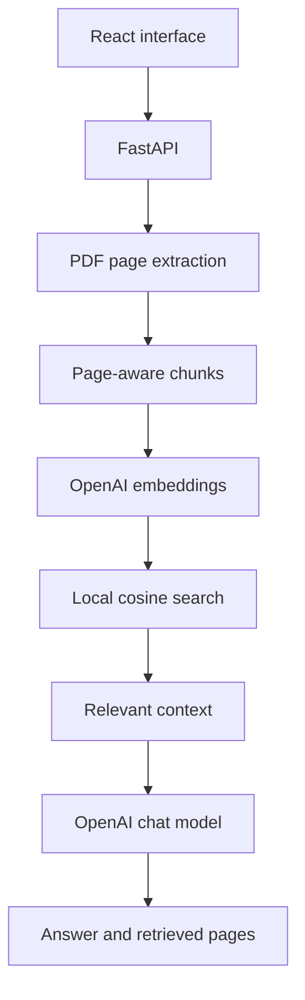

# AI Study Assistant

Upload a lecture PDF and ask questions about its contents. The app retrieves relevant text and uses an AI model to generate an answer, with page references from the retrieved passages.

## Features

- PDF upload with size and format validation
- Page-aware text extraction and overlapping chunks
- API-generated embeddings with local cosine-similarity search
- Retrieval-augmented answers and source-page references
- Responsive chat interface with loading and error states

**Scope:** One active PDF per backend process. The document index stays in memory and resets when the server restarts. Text-based PDFs work; scanned images require OCR, which is not included. Sources list retrieved pages; they are leads for verification, not proof that every sentence is supported. An OpenAI API key and network access are required; API usage can incur charges.

## Architecture



## How RAG works

On upload, PyMuPDF extracts text separately from each page. Text is split into roughly 1,100-character passages with 180-character overlap, preserving page numbers and context near boundaries. OpenAI turns passages into vectors; NumPy normalizes them. A question is embedded with the same model and compared against the saved vectors using cosine similarity. The top four passages are sent to the chat model along with instructions to answer from the document alone. The response displays unique page numbers from those retrieved passages.

## Technologies

Python, FastAPI, PyMuPDF, NumPy, httpx, OpenAI API, React, Vite, JavaScript, CSS.

## Installation

Requires Python 3.10+, Node.js 20+, npm, and an OpenAI API key.

### Backend

```bash
cd backend
python -m venv .venv
# Windows PowerShell: .venv\Scripts\Activate.ps1
# macOS/Linux: source .venv/bin/activate
pip install -r requirements.txt
cp .env.example .env  # Windows PowerShell: Copy-Item .env.example .env
# Edit backend/.env and set OPENAI_API_KEY
uvicorn app.main:app --reload
```

Check `http://localhost:8000/health` for `{"status":"ok"}`.

### Frontend (second terminal)

```bash
cd frontend
npm install
npm run dev
```

Open `http://localhost:5173`. If the backend runs elsewhere, set `VITE_API_URL` for the frontend. Set `FRONTEND_ORIGIN` in backend `.env` if the frontend origin changes. Do not place the API key in Vite variables or commit `.env`.

## API

| Endpoint | Input | Output |
| --- | --- | --- |
| `GET /health` | None | Status |
| `POST /upload` | Multipart `file` PDF, max 15 MB | Filename, text-page count, chunk count |
| `POST /ask` | JSON `{"question":"..."}` | Answer and retrieved document/page references |

Try a text PDF with a fact you can verify on a known page. Ask a question about it and inspect the returned pages. Ask an unrelated question to check whether the model acknowledges missing information. An API key is necessary to run this live workflow.

## Screenshots

### Upload interface

[Add screenshot after running the app]

### Answer with source pages

[Add screenshot after asking about an uploaded PDF]

## Future improvements

Authentication, multiple documents, persistent indexes, conversation history, PostgreSQL, flashcards, quizzes, Docker, and cloud deployment are future ideas, not current features.

## GitHub details

Repository name: `ai-study-assistant-rag`

Description: AI study assistant that uses RAG to answer questions from uploaded lecture PDFs with source page references.

Topics: `rag`, `fastapi`, `react`, `pdf`, `embeddings`, `semantic-search`, `portfolio-project`
