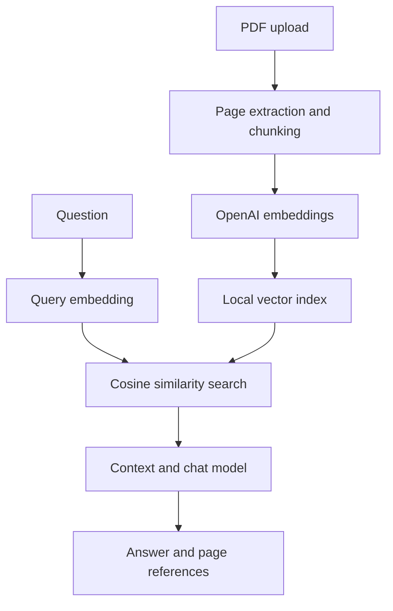

# AI Study Assistant

A web application for asking questions about PDF lecture notes. It retrieves relevant passages and sends them to an OpenAI chat model, then displays the answer alongside the retrieved page references.

## Features

- PDF upload with format validation and a 15 MB size limit
- Text extraction that preserves document names and page numbers
- Overlapping text chunks and API-generated embeddings
- Local cosine-similarity search using NumPy
- Document-based answers with retrieved source pages
- Responsive React interface with loading and error states

## How it works

PyMuPDF extracts text separately from each page. The backend splits it into passages of approximately 1,100 characters with 180 characters of overlap. Each passage retains its filename and page number.

OpenAI generates embeddings for the passages and the question. The backend normalizes the vectors and ranks passages by cosine similarity. It sends the four highest-ranked passages to the chat model as context. Source references come from the retrieved passages.



## Stack

Python, FastAPI, PyMuPDF, NumPy, httpx, OpenAI API, React, Vite, JavaScript, and CSS.

## Setup

Requires Python 3.10+, Node.js 20+, npm, and an OpenAI API key. Run the backend and frontend in separate terminals from the repository root.

### Backend: Windows PowerShell

```powershell
cd backend
py -m venv .venv
.\.venv\Scripts\python.exe -m pip install -r requirements.txt
Copy-Item .env.example .env
```

Set `OPENAI_API_KEY` in `backend/.env`, then start the server:

```powershell
.\.venv\Scripts\python.exe -m uvicorn app.main:app --reload
```

### Backend: macOS or Linux

```bash
cd backend
python3 -m venv .venv
.venv/bin/python -m pip install -r requirements.txt
cp .env.example .env
```

Set `OPENAI_API_KEY` in `backend/.env`, then start the server:

```bash
.venv/bin/python -m uvicorn app.main:app --reload
```

The backend runs at `http://localhost:8000`. `GET /health` returns `{"status":"ok"}`.

### Frontend

In a second terminal, from the repository root:

```bash
cd frontend
npm ci
npm run dev
```

Open `http://localhost:5173`. Upload a text-based PDF and enter a question after processing completes.

`VITE_API_URL` configures the frontend's backend address. `FRONTEND_ORIGIN` in `backend/.env` configures the allowed frontend origin. API keys belong only in the backend environment; `.env` is excluded by `.gitignore`.

## API

| Endpoint | Input | Output |
| --- | --- | --- |
| `GET /health` | None | Status |
| `POST /upload` | Multipart PDF field named `file` | Filename, text-page count, chunk count |
| `POST /ask` | JSON with a `question` field | Answer and retrieved document/page references |

## Testing

From the `backend` directory, run the offline integration check:

```powershell
.\.venv\Scripts\python.exe -m tests.test_flow
```

On macOS or Linux, use `.venv/bin/python -m tests.test_flow`.

The test covers health, invalid uploads, two-page PDF extraction, retrieval, and source-page metadata. Embeddings and answers are mocked in this test; live OpenAI requests require a separate manual check with an API key.

## Limitations

- One active PDF is shared by the backend process.
- The index is stored in memory and resets when the server restarts.
- Scanned PDFs require OCR, which is not implemented.
- The interface displays the current session's messages; earlier messages are not included in model requests.
- Source pages identify retrieved passages and do not guarantee support for every sentence in an answer.
- Embeddings and retrieved text are sent to OpenAI. Network access is required, and API usage may incur charges.
